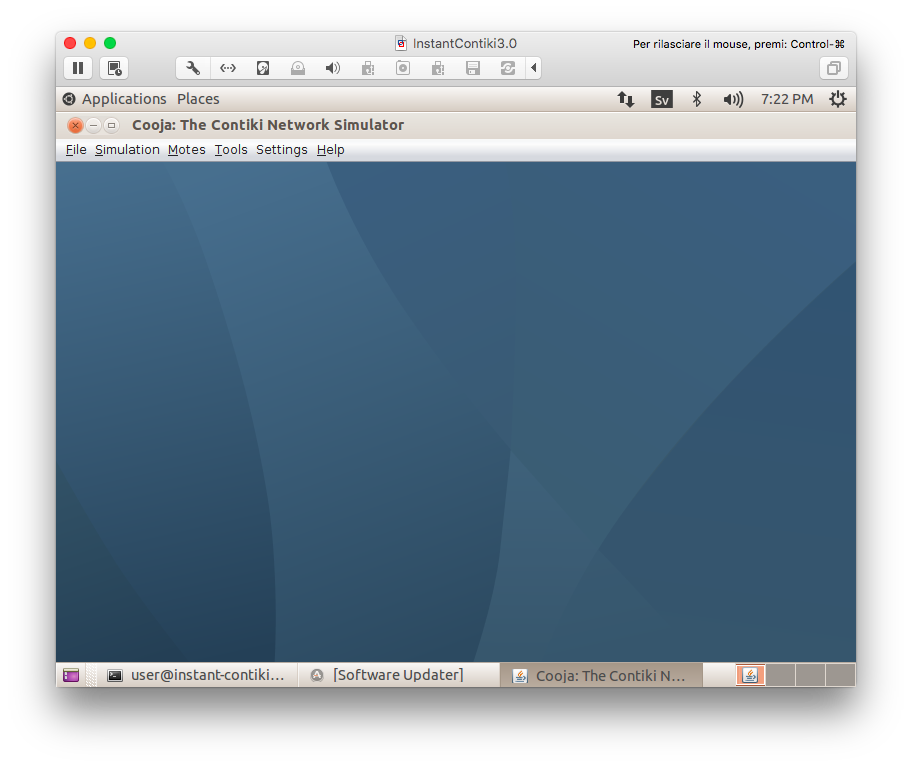
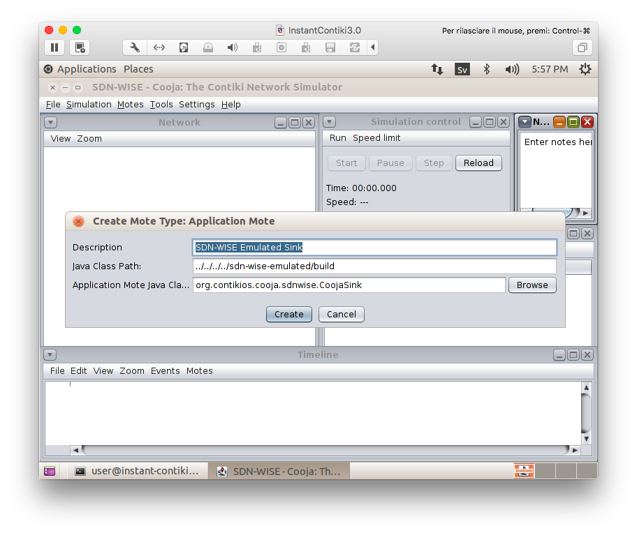
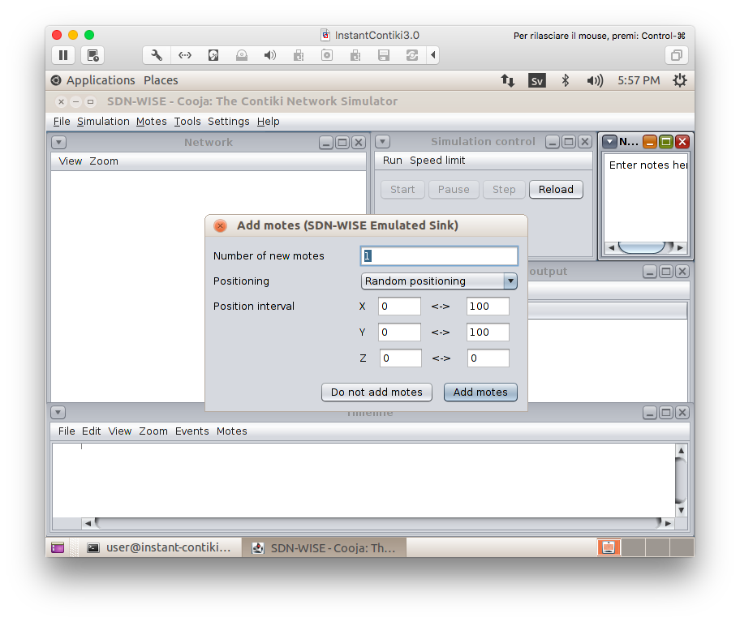
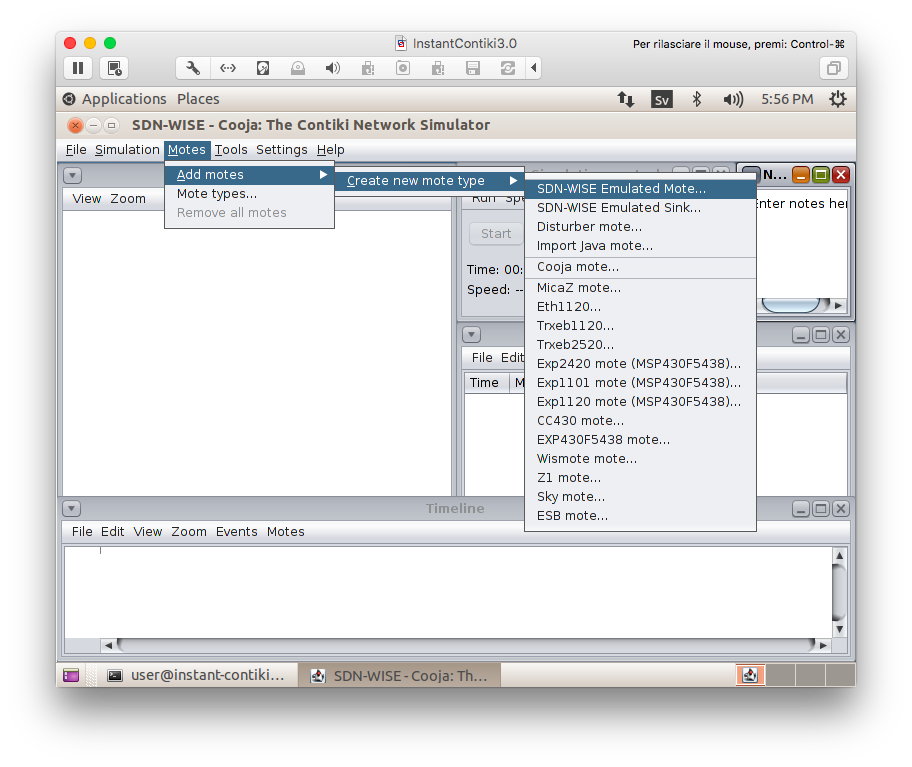
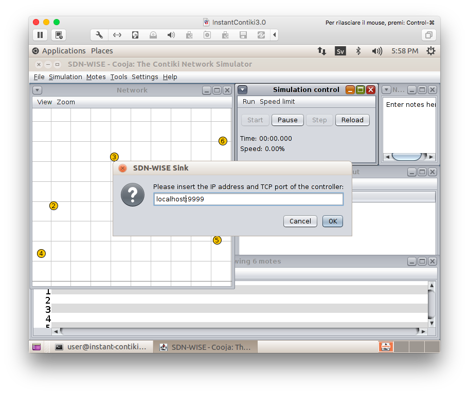
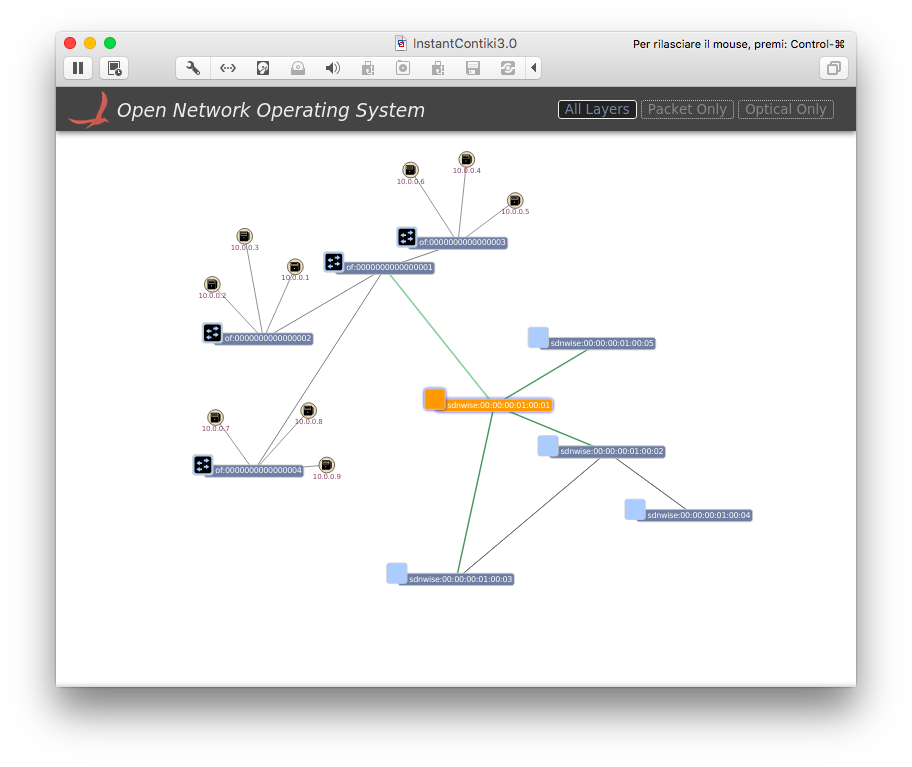

This document explains how to deploy a virtual network using SDN-WISE, Cooja, Mininet and ONOS in a Virtual Machine (VM). The target of this document is to create an integrated network controlled by ONOS where a virtual network of OpenFlow switches can communicate with the nodes of an emulated SDN-WISE wireless sensor network.

# Step 1: Virtual Machine
We begin by downloading Instant Contiki, installing VMWare Player, and booting up Instant Contiki.
You can find more details on Contiki and Instant Contiki [here](http://www.contiki-os.org/start.html). 

### Download Instant Contiki and Install VMWare Player
Download Instant Contiki from [here](http://sourceforge.net/projects/contiki/files/Instant%20Contiki/Instant%20Contiki%203.0/InstantContiki3.0.zip/download). It is a large file, just over 2GB. When downloaded, unzip the file, place the unzipped directory on the desktop. Then download and install VMWare Player from [here](https://my.vmware.com/web/vmware/free#desktop_end_user_computing/vmware_workstation_player/12_0). It is free to download. It might require a reboot of your computer, which is unfortunate but needed to get networking working.

### Boot Ubuntu
Start Instant Contiki by running `Instant_Contiki_Ubuntu_12.04_32-bit.vmx`. Wait for the virtual Ubuntu Linux boot up. Log into Instant Contiki. The password is `user`.


# Step 2: Setup the environment
Now we will download the source code for SDN-WISE, Contiki, Mininet and ONOS.

### Download the needed software
First open a new terminal window ( press Ctrl+Alt+t ). The following script will download and compile all the needed software for the tutorial.
```
cd && wget https://raw.githubusercontent.com/sdnwiselab/onos/onos-sdn-wise-1.10/tools/tutorials/sdn-wise/sdn-wise.sh && sudo chmod +rx sdn-wise.sh 

```
Insert the password `user` when prompted and run the script using the following command:
```
sudo ./sdn-wise.sh

```

### Compile ONOS
Write in the terminal:
```
echo "export ONOS_ROOT=~/onos" >> ~/.bashrc && source ~/.bashrc && source $ONOS_ROOT/tools/dev/bash_profile && cd ~/onos &&
tools/build/onos-buck build onos --show-output && tools/build/onos-buck run onos-local -- clean debug
```

Congratulations! You have just installed SDN-WISE, ONOS, Mininet and Contiki!

# Step 3: Start!
Now we will start all the downloaded softwares. After these steps your VM may run short on RAM, if this is you case please use this [link](https://kb.vmware.com/selfservice/microsites/search.do?language=en_US&cmd=displayKC&externalId=1004059) to learn how to increase the RAM assigned to the VM.

### Start ONOS
Start ONOS in a new terminal:
```
cd ~/onos && tools/test/bin/onos localhost

```
Then run:
```
app activate org.onosproject.sdnwise

```

Now you can open a browser pointing to `http://localhost:8181/onos/ui` (in a terminal write `xdg-open http://localhost:8181/onos/ui`).

Input `user` as user and `rocks` as password.

### Start Mininet
Open a new terminal and write:
```
sudo mn --topo tree,depth=2,fanout=3 --controller=remote

```
When Mininet is started run the `pingall` command.


### Start Cooja
To start cooja write in a new terminal:
```
cd ~/sdn-wise-contiki/contiki/tools/cooja/ && ant run
```
When Cooja is started, it will show a blue empty window.

Click on `Settings -> Cooja extensions...`

Enlarge the left part of the window, scroll down and select `sdn-wise-emulated`

Then click on `Apply for session`

#Step 3: Create a heterogeneous network

## Create a new simulation
Clik on `File -> New simulation...` 


### Set simulation options
Enter as simulation name `SDN-WISE`. Click the `Create` button.


### Simulation windows
Cooja brings up the new simulation. The `Network window`, at the top left of the screen, shows all the motes in the simulated network - it is empty now, since we have no motes in our simulation. The `Timeline window`, at the bottom of the screen, shows all communication events in the simulation over time - very handy for understanding what goes on in the network. The `Mote output` window, on the right side of the screen, shows all serial port printouts from all the motes. The `Notes window` on the top right is where we can put notes for our simulation. And the `Simulation control window` is where we start, pause, and reload our simulation. 


### Add Java Emulated SDN-WISE nodes

In this tutorial we will teach you how to add some Java emulated SDN-WISE nodes and then we will give you the details on how to use Contiki Simulated nodes. For the Java ones, let's start by adding a Sink. Click on `Motes -> Add motes -> Create new mote type -> SDN-WISE Emulated Sink...` 

then click on `Create`... 

...and `Add motes`.

Then we repeat the same commands for the other nodes of the network, but this time we choose `Motes -> Add motes -> Create new mote type -> SDN-WISE Emulated Mote...` 

and we add 5 motes instead of one.

### Setup the windows
In the Network window, click on `View`. The following items should be selected:

- Mote relations
- Mote IDs
- Radio traffic
- 10m background grid
- Mote type
- Radio environment (UDGM)

Click on `Tools -> Radio messages`. A new window will appear. This window will show all the details regarding the messages sent over the Radio. We are going to use it later. Check that all the nodes can be reached by the sink, directly or by multiple hops. You can see it by clicking on a node. A green circle will appear. All the nodes inside the green area can be reached by the selected one. There is also a gray circle. This circle represents the interference area of the node. 
Now we will setup the simulation speed. Because we need to interact with an external controller, in the Simulation control window click on `Speed limit` and select `100%`.

At this moment everything should be set and we can run the simulation by clicking on the menu `Simulation -> Start simulation`. When prompted insert `localhost:9999` as the location for the controller.


# Conclusions
Finally if you check your browser you will see that ONOS has recognized the whole network and it is now ready to route packets between the Mininet hosts and the SDN-WISE nodes.
