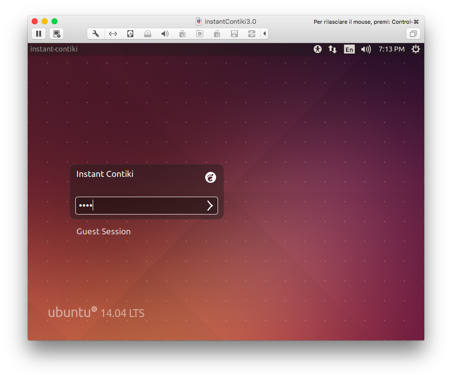
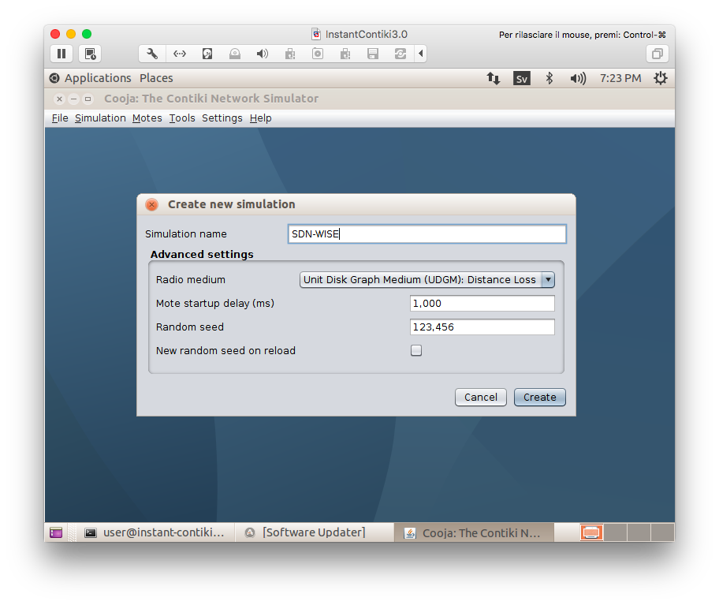
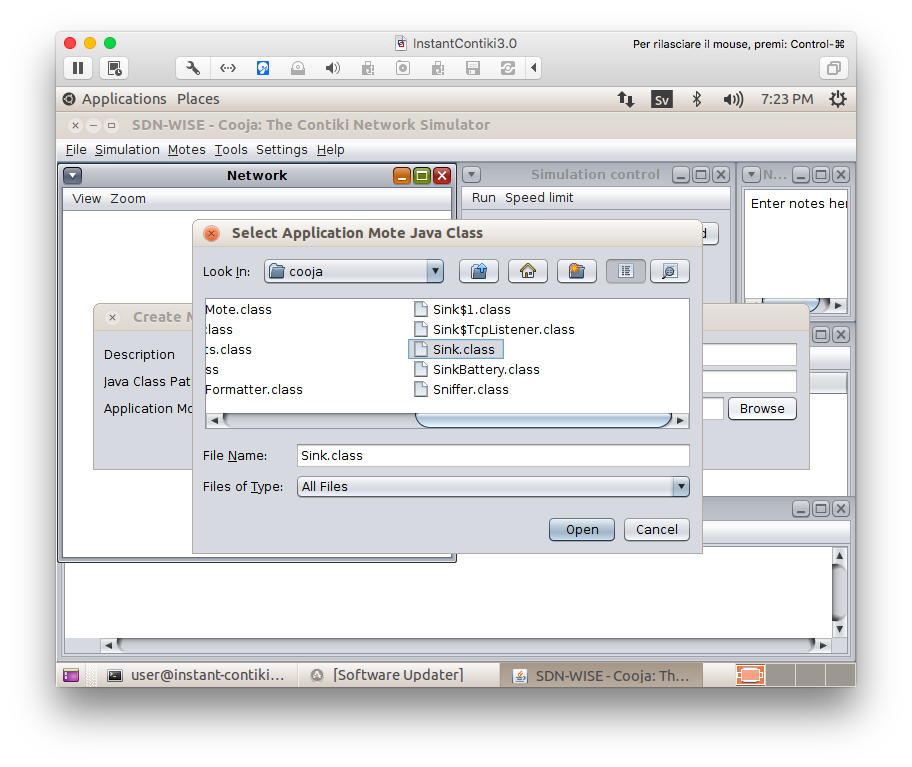
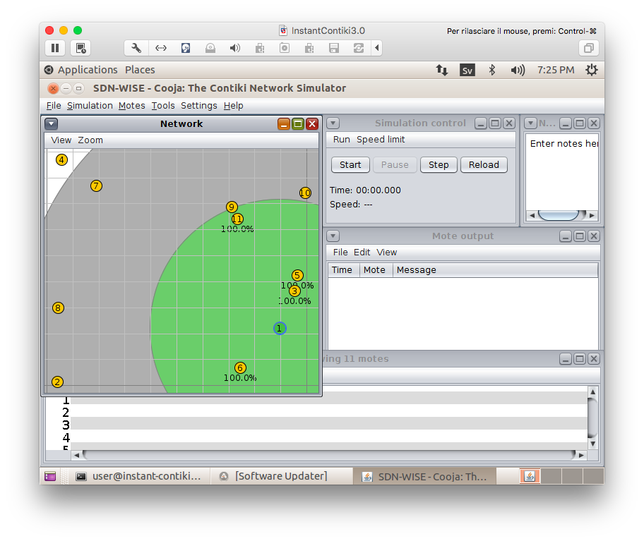

This document explains how to deploy a virtual wireless sensor network using Cooja and SDN-WISE.

# Step 1: Grab Instant Contiki
We begin by downloading Instant Contiki, installing VMWare Player, and booting up Instant Contiki.
You can find more details on Contiki and Instant Contiki [here](http://www.contiki-os.org/start.html). 

### Download Instant Contiki
Download Instant Contiki. It is a large file, just over 2GB. When downloaded, unzip the file, place the unzipped directory on the desktop. 

[Download Instant Contiki](http://sourceforge.net/projects/contiki/files/Instant%20Contiki/Instant%20Contiki%203.0/InstantContiki3.0.zip/download)

### Install VMWare Player
Download and install VMWare Player. It is free to download. It might require a reboot of your computer, which is unfortunate but needed to get networking working. 

[Download VMWare Player](https://my.vmware.com/web/vmware/free#desktop_end_user_computing/vmware_workstation_player/12_0)

## Start Instant Contiki

### Boot Ubuntu
Start Instant Contiki by running `Instant_Contiki_Ubuntu_12.04_32-bit.vmx`. Wait for the virtual Ubuntu Linux boot up.

### Log in
Log into Instant Contiki. The password is `user`.



# Step 2: Start Cooja
Now we will download the source code for the virtual SDN-WISE nodes and then we will compile and start Cooja, the Contiki network simulator.

### Open a terminal window
First open a terminal window ( press Ctrl+Alt+t ). Let's free up some space. Write the following:
```
rm -Rf ~/contiki-3.0
sudo apt-get remove --purge libreoffice* openjdk-* firefox

```
Use password `user` when prompted, then write:
```
sudo apt-get clean
sudo apt-get autoremove

```

### Update to Java 8 and install Ant and Maven
SDN-WISE uses Java 8. To install it write the following commands in the terminal. 

```
sudo add-apt-repository ppa:openjdk-r/ppa -y
sudo apt-get update
sudo apt-get install openjdk-8-jdk ant maven2 -y
sudo update-java-alternatives -s java-1.8.0-openjdk-i386

```
When the installation is complete, write:
```
sed -i '/export JAVA_HOME=\/usr\/lib\/jvm\/java-7-openjdk-i386/c\export JAVA_HOME=/usr/lib/jvm/java-8-openjdk-i386' ~/.bashrc
source ~/.bashrc

```

### Compile Cooja and SDN-WISE
The following commands will download the source code for the simulated nodes and compile Cooja. In the terminal window, copy the following: 
```
cd ~/contiki/tools
wget https://sdnwiselab.github.io/tools/sdn-wise_java.tar.gz
tar xvf sdn-wise_java.tar.gz
rm sdn-wise_java.tar.gz
cd cooja
git submodule update --init
ant jar_cooja
cd examples/sdn-wise_java
ant compile

```

### Start Cooja
Now you can start Cooja. Write in the terminal:
```
cd ~/contiki/tools/cooja
ant run

```

### Wait for Cooja to start
When Cooja is started, it will show a blue empty window.


#Step 3: Create a virtual SDN-WISE network

## Create a new simulation
Clik on `File -> New simulation...` 


### Set simulation options
Enter as simulation name `SDN-WISE`. Click the `Create` button.




### Simulation windows
Cooja brings up the new simulation. The `Network window`, at the top left of the screen, shows all the motes in the simulated network - it is empty now, since we have no motes in our simulation. The `Timeline window`, at the bottom of the screen, shows all communication events in the simulation over time - very handy for understanding what goes on in the network. The `Mote output` window, on the right side of the screen, shows all serial port printouts from all the motes. The `Notes window` on the top right is where we can put notes for our simulation. And the `Simulation control window` is where we start, pause, and reload our simulation. 


### Add a Sink to the simulation
Click on `Motes -> Add motes -> Create new mote type -> import Java mote... `.


In the `Create Mote Type: Application Mote` window click the `Browse` button.
Select the file called `Sink.class` in `/home/user/contiki/tools/cooja/examples/sdn-wise_java/build/com/github/sdnwiselab/sdnwise/cooja/` and click `Open`



In the description field write `SDN-WISE Sink` and click the `Create` button and then click the `Add motes` button. 


After this step you will be asked to write an IP address and a TCP port. Leave `localhost:9991` and press `Ok`.


### Add some Motes to the simulation
Repeat the previous step but this time select the file `Mote.class` in the same folder as before, use `SDN-WISE Mote` as description and add 10 motes instead of 1. 


### Setup the windows
In the Network window, click on View. The following items should be selected:

- Mote relations
- Mote IDs
- Radio traffic
- 10m background grid
- Mote type
- Radio environment (UDGM)


Click on `Tools -> Radio messages`. A new window will appear. This window will show all the details regarding the messages sent over the Radio. We are going to use it later.

Check that all the nodes can be reached by the sink, directly or by multiple hops. You can see it by clicking on a node. A green circle will appear. All the nodes inside the green area can be reached by the selected one. There is also a gray circle. This circle represents the interference area of the node. We are not interested in this feature so you can `right click on a node -> Change transmission ranges -> set INT range to 0`. This will change the behavior of all the nodes in the network.




In the Simulation control window click on `Speed limit` and select `100%` 


#Step 4: Run the Controller
Now we need a controller. You are going to download a simple controller that uses Dijkstra's routing algorithm. 

## Download and run the controller

Open a new terminal and write:
```
cd ~
wget http://sdn-wise.dieei.unict.it/tools/01-GetStarted.tar.gz
tar xvf 01-GetStarted.tar.gz
rm 01-GetStarted.tar.gz
cd 01-GetStarted
mvn package
java -jar target/01-GetStarted.jar
```

The controller responds to the requests coming from the nodes and after 60 seconds it sends messages containing the string "Hello World!" to the nodes.


# Step 5: Start the Simulation
Go back to Cooja and in the Simulation control window click `Start`.

The Sink node is the first node in the network receiving the messages sent by the user. It checks in its WISE Flow Table, it does not find a matching rule and then it asks the controller. The controller provides a path to reach the destination and sends the corresponding rules. The nodes in this path learn the rules and thus can correctly forward the message.

When a node receives a message for itself it prints the payload in the Mote output window


# Conclusions
Congratulations you have deployed a complete SDN-WISE virtual sensor network using Cooja!
The next tutorials will cover more details on the nodes and the controller.